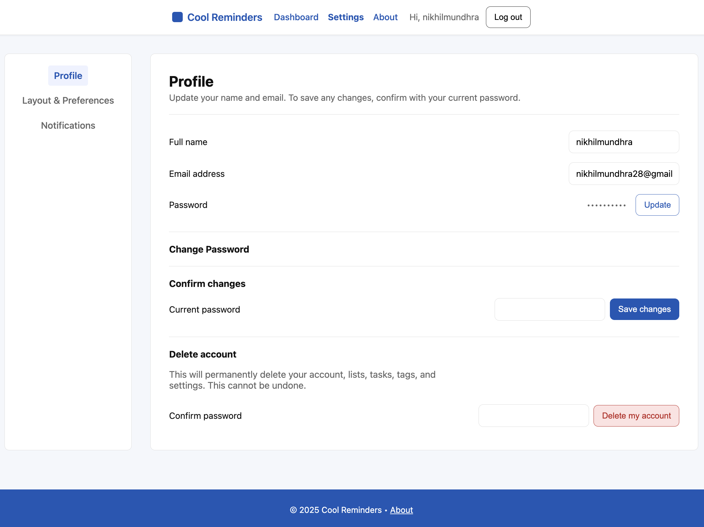
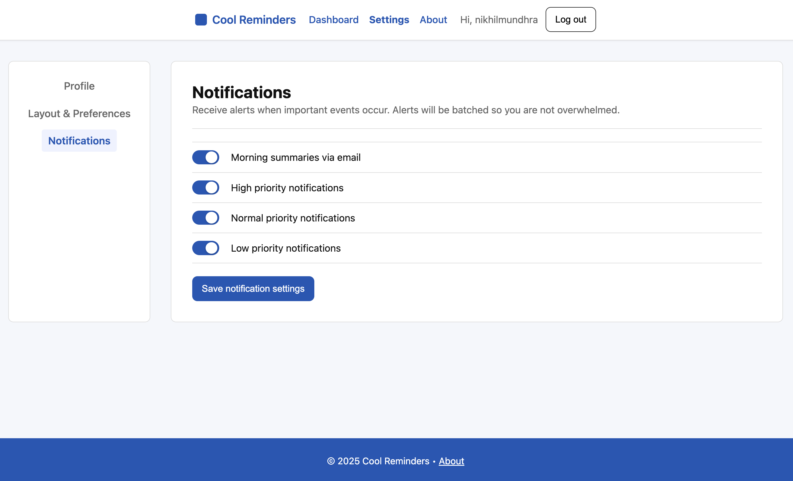
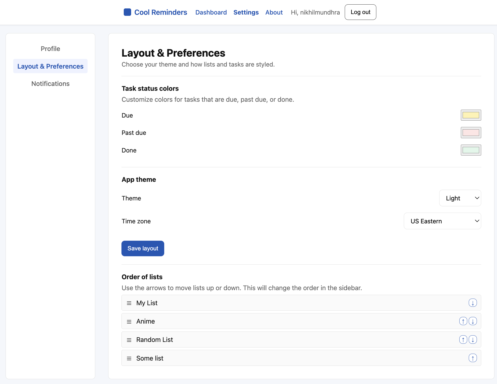
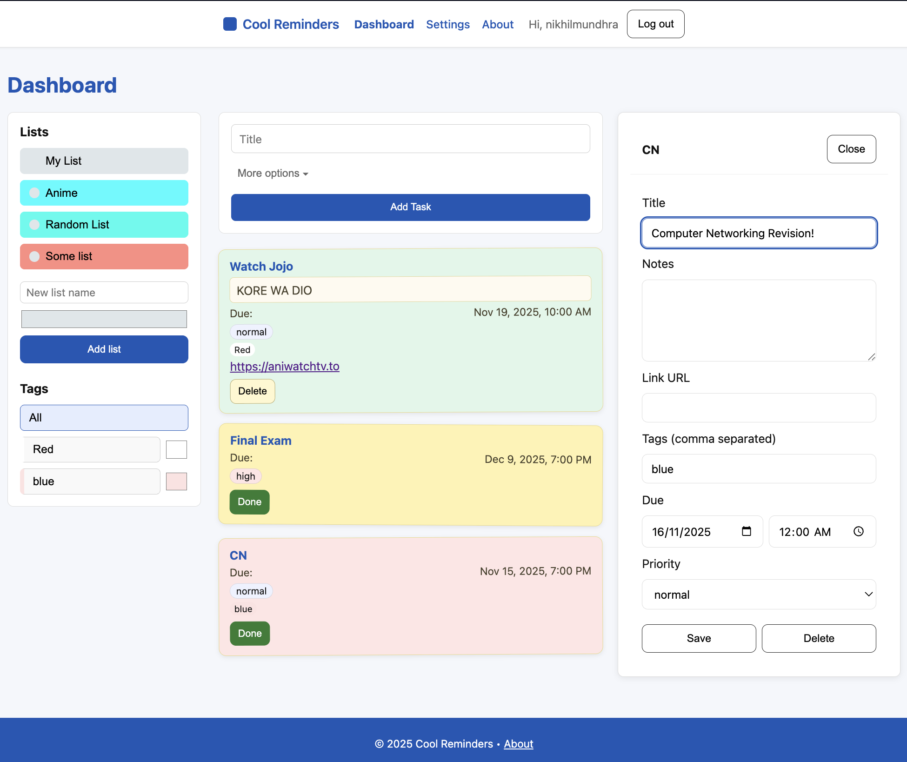
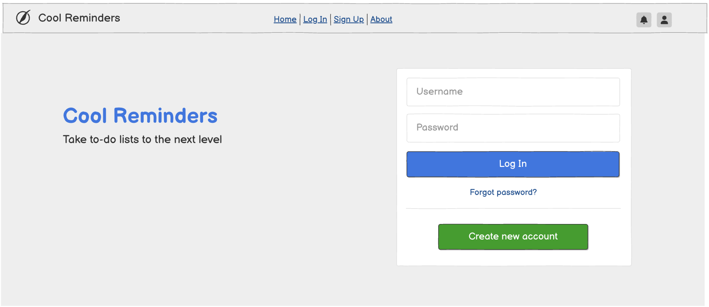
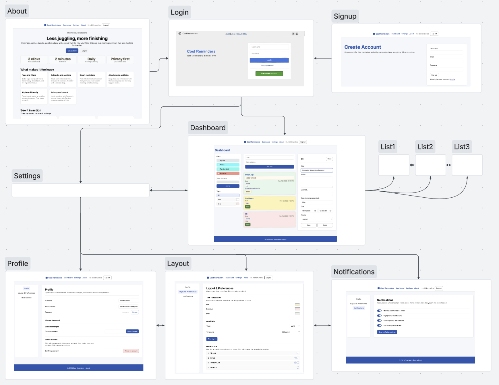

# Cool Reminders 

## Overview

Your brain is an F1 car; your tasks are traffic cones. Chaos ensues. Cool Reminders corrals the cones with color tags, subtasks, and timely nudges, plus optional morning email summaries and a layout you can rearrange to feel just right.

Cool Reminders is a web app for managing multiple to do lists. Users can register and sign in, and after signing in, they can create lists, add tasks, set dates and reminders, and mark tasks complete. They can also organize with color tags, priority filters, nested sections and subtasks, plus optional morning email summaries.

## Live URL

It might take a minute to load:

https://ait-final-project-nikhil-mundhra.onrender.com/

## Repository (Base version) Link

https://github.com/Nikhil-Mundhra/Cool-Reminders/blob/CoolReminders1.0_2025Nov19/

## Link to Commented Schema
https://github.com/Nikhil-Mundhra/Cool-Reminders/blob/main/CoolReminders1.0_2025Nov19/db.mjs

## Link to Main Project File
https://github.com/Nikhil-Mundhra/Cool-Reminders/blob/main/CoolReminders1.0_2025Nov19/app.mjs

## Data Model

The application will store the following data:

* User // account holder
    *  Settings // theme, layout, reminder defaults, timezone, channels
    *  Lists // all lists owned or shared
        *  List // title, icon, color, sharing
            *  Task // one item
                * Subtasks // nested children
                * Section // optional grouping
                * Notes // rich text
                * Links // {url, title}
                * Dates // start, due, repeat
                * Reminders // early offsets, scheduled events
                * Attachments // files or images
                * Tags // refs to Tag
                * Priority // low, normal, high
                * Completion // done flag, timestamp
    *  Tags
          * Tag // name, color, createdAt, updatedAt
    * Progress // 0 to 100% of the tasks_done/total_tasks
* Logins // Username, email, password sets

The following relationships are one -> one:
* User -> setting.
* Task -> section / Notes / Priority / completion

The following relationships are one -> many:
* List -> Task
* Task -> Subtask / Links / Reminders / Tags

**User Authentication (Auth middleware)**  
Auth middleware (JSON-aware) used to protect Task routes:  
  `routes/helpers.mjs`  
https://github.com/Nikhil-Mundhra/Cool-Reminders/blob/1a5b58cac3505cfc9b9f1dc6b348321a2808a254/CoolReminders1.0_2025Nov19/routes/helpers.mjs#L9

 Middleware Usage:
 `routes/tasks.mjs` 
- https://github.com/Nikhil-Mundhra/Cool-Reminders/blob/1a5b58cac3505cfc9b9f1dc6b348321a2808a254/CoolReminders1.0_2025Nov19/routes/tasks.mjs#L37
- https://github.com/Nikhil-Mundhra/Cool-Reminders/blob/1a5b58cac3505cfc9b9f1dc6b348321a2808a254/CoolReminders1.0_2025Nov19/routes/tasks.mjs#L80
- https://github.com/Nikhil-Mundhra/Cool-Reminders/blob/1a5b58cac3505cfc9b9f1dc6b348321a2808a254/CoolReminders1.0_2025Nov19/routes/tasks.mjs#L111
- https://github.com/Nikhil-Mundhra/Cool-Reminders/blob/1a5b58cac3505cfc9b9f1dc6b348321a2808a254/CoolReminders1.0_2025Nov19/routes/tasks.mjs#L170
- https://github.com/Nikhil-Mundhra/Cool-Reminders/blob/1a5b58cac3505cfc9b9f1dc6b348321a2808a254/CoolReminders1.0_2025Nov19/routes/tasks.mjs#L226

**Client-side form validation with Parsley.js**

 Attaches Parsley to any form that opts in:
 `views/layout.hbs` 
- https://github.com/Nikhil-Mundhra/Cool-Reminders/blob/1a5b58cac3505cfc9b9f1dc6b348321a2808a254/CoolReminders1.0_2025Nov19//views/layout.hbs#L13

```html
<script src="https://cdn.jsdelivr.net/npm/parsleyjs@2/dist/parsley.min.js"></script>
    <script>
      /* attach Parsley to any form that opts in */
      document.addEventListener('DOMContentLoaded', function () {
        var forms = document.querySelectorAll('form[data-validate="true"]');
        if (window.Parsley && forms.length) {
          window.Parsley.addValidator('notblank', {
            validateString: function (value) { return value.trim().length > 0; },
            messages: { en: 'Required' }
          });
          Array.prototype.forEach.call(forms, function (f) { f.parsley(); });
        }
      });
    </script>
```

**AJAX**
* An AJAX request: 
`routes/dashboard.mjs`
https://github.com/Nikhil-Mundhra/Cool-Reminders/blob/1a5b58cac3505cfc9b9f1dc6b348321a2808a254/CoolReminders1.0_2025Nov19/public/js/dashboard.js#L43
* Updating the UI without reloading: 
https://github.com/Nikhil-Mundhra/Cool-Reminders/blob/1a5b58cac3505cfc9b9f1dc6b348321a2808a254/CoolReminders1.0_2025Nov19/public/js/dashboard.js#L76

**Bcrypt**  
* Login + Signup routes (hash/compare):  
`routes/auth.mjs`
- https://github.com/Nikhil-Mundhra/Cool-Reminders/blob/1a5b58cac3505cfc9b9f1dc6b348321a2808a254/CoolReminders1.0_2025Nov19/routes/auth.mjs#L70
- https://github.com/Nikhil-Mundhra/Cool-Reminders/blob/1a5b58cac3505cfc9b9f1dc6b348321a2808a254/CoolReminders1.0_2025Nov19/routes/auth.mjs#L99
- https://github.com/Nikhil-Mundhra/Cool-Reminders/blob/1a5b58cac3505cfc9b9f1dc6b348321a2808a254/CoolReminders1.0_2025Nov19/routes/auth.mjs#L155

An Example Login:

```javascript
{
  UserID: /* unique ID linked to user's settings, lists, etc*/,
  username: "Nikticks Reminders",
  email: "nik@xyz.abc",
  hash: // a password hash,
}
```

An Example settings for a User

```javascript
{
  settingsId: /* unique ID */,
  theme: "light",                               // UI theme
  layoutOrder: ["Today", "Scheduled", "All"],   // preferred sections order
  defaultReminderOffsetMinutes: 30,             // nudge before due time
  morningSummaryEmail: true,                    // send daily summary
  timezone: "America/New_York",                 // IANA timezone
  notificationChannels: ["email", "push"],      // delivery methods
  createdAt: /*timestamp*/,
  updatedAt: /*timestamp*/
}
```

An Example Task

```javascript
{
  taskId: "tsk_7c61e901",                        // unique ID
  listId: "lst_42ac77ee",                        // parent list reference
  parentTaskId: null,                            // set to a taskId for a subtask
  title: "Finish lab",                // task title
  notes: "Debug app.mjs and add .gitignore", // rich text allowed
  links: [                                       // related links
    { url: "https://https://www.CoolReminders.com/", title: "Cool Reminders" }
  ],
  tags: ["tag_priority", "tag_cs"],              // refs to Tag
  priority: "high",                              // low, normal, high
  dueAt: "2025-10-31T16:00:00Z",                 // due datetime
  repeatRule: null,                               // iCal RRULE string if repeating
  reminderOffsetsMinutes: [120, 30],             // early nudges in minutes
  attachments: [                                  // files or images
    {
      attachmentId: "att_33aa22ff",
      fileUrl: "https://cdn.example.com/files/lab-checklist.pdf",
      mimeType: "application/pdf"
    }
  ],
  section: "Applied Internet Tech",               // optional grouping label
  completed: false,                               // completion flag
  completedAt: null,                              // timestamp if completed
  position: 3,                                    // ordering within parent
  createdAt: /*timestamp*/,
  updatedAt: /*timestamp*/
}
```

## Wireframes

Wireframes for all of the pages on site; used Balsamiq.

- Page for updating profile info



- Page for updating notification settings



- Page for updating layout and theme preferences



- Main page with some tasks for example:



- Login Page



## Site map

/list/slug - Here's the site map



## User Stories or Use Cases

1. As a non registered user, I can register a new account with the site, or use a guest login.
2. As a user, I can sign in and sign out of the site.
3. As a user, I can create, view, rename, and delete my to do lists.
4. As a user, I can create tasks in a selected list and view all tasks in that list.
5. As a user, I can mark a task complete and/or delete it.
6. As a user, I can delete my account.
7. As a user, I can set date and time on a task.
8. As a user, I can double click and rename lists and set them to different colors.
9. As a user, I can add notes and links to a task to keep related information together.
10. As a user, I can create tags, edit tags, and apply tags to tasks.
11. As a user, I can filter or view tasks by tag, priority, or common lists such as Today and Scheduled.
12. As a user, I can set the priority on a task to low, normal, or high.
13. As a user, I can reorder lists in settings/layout.
14. As a user, I can share a list with other users and control whether they can view or edit it.
15. As a user, I can upload or attach files to a task.
16. As a user, I can update my personal settings such as theme, layout order, timezone, and notification channels.


## Annotations / References Used

1. [Passport.js authentication docs](http://passportjs.org/docs)  
  * Used in `app.mjs` for configuring `passport` and `passport.session()` middleware:
      https://github.com/Nikhil-Mundhra/Cool-Reminders/blob/1a5b58cac3505cfc9b9f1dc6b348321a2808a254/CoolReminders1.0_2025Nov19/app.mjs#L72
  * In `routes/auth.mjs` for the `/signup` and `/login` route handlers that call `passport.authenticate(...)`.
      https://github.com/Nikhil-Mundhra/Cool-Reminders/blob/1a5b58cac3505cfc9b9f1dc6b348321a2808a254/CoolReminders1.0_2025Nov19/routes/auth.mjs#L109
  * In `routes/passport.mjs` to `serializeUser` and `deserializeUser`.
   https://github.com/Nikhil-Mundhra/Cool-Reminders/blob/1a5b58cac3505cfc9b9f1dc6b348321a2808a254/CoolReminders1.0_2025Nov19/routes/passport.mjs#L57

2. [Vue.js 3 Guide](https://vuejs.org/guide/introduction.html)  
   Used in `public/js/dashboard.js` inside `bootstrapVueDashboard()` and the `DashboardApp` `createApp({...})` call that hydrates `#dashboard-app` and controls `quickaddExpanded` and `drawerOpen`.
   https://github.com/Nikhil-Mundhra/Cool-Reminders/blob/1a5b58cac3505cfc9b9f1dc6b348321a2808a254/CoolReminders1.0_2025Nov19/public/js/dashboard.js#L34
   https://github.com/Nikhil-Mundhra/Cool-Reminders/blob/1a5b58cac3505cfc9b9f1dc6b348321a2808a254/CoolReminders1.0_2025Nov19/public/js/dashboard.js#L49

3. [Parsley.js Documentation](https://parsleyjs.org/doc/)  
  * Used in `views/layout.hbs` to include the Parsley CDN script and 
    https://github.com/Nikhil-Mundhra/Cool-Reminders/blob/1a5b58cac3505cfc9b9f1dc6b348321a2808a254/CoolReminders1.0_2025Nov19/views/layout.hbs#L14
  * In `views/dashboard.hbs` on the quick add task form with attributes such as `data-parsley-notblank`, `data-parsley-maxlength`, and `data-parsley-notpast`.
    https://github.com/Nikhil-Mundhra/Cool-Reminders/blob/1a5b58cac3505cfc9b9f1dc6b348321a2808a254/CoolReminders1.0_2025Nov19/views/dashboard.hbs#L113
   

4. [Socket.IO Client API](https://socket.io/docs/v4/client-api/)  
  Used in `public/js/dashboard.js`:
   https://github.com/Nikhil-Mundhra/Cool-Reminders/blob/1a5b58cac3505cfc9b9f1dc6b348321a2808a254/CoolReminders1.0_2025Nov19/public/js/dashboard.js#L110
  - `socket.on('list:updated')`, `socket.on('list:deleted')`, and `socket.on('task:deleted')` keep lists and tasks in sync:
   https://github.com/Nikhil-Mundhra/Cool-Reminders/blob/1a5b58cac3505cfc9b9f1dc6b348321a2808a254/CoolReminders1.0_2025Nov19/public/js/dashboard.js#L579


5. [MDN Web Docs: Fetch API](https://developer.mozilla.org/en-US/docs/Web/API/Fetch_API)  
  * Used in `public/js/dashboard.js` in helper functions such as:
   https://github.com/Nikhil-Mundhra/Cool-Reminders/blob/1a5b58cac3505cfc9b9f1dc6b348321a2808a254/CoolReminders1.0_2025Nov19/public/js/dashboard.js#L161
   https://github.com/Nikhil-Mundhra/Cool-Reminders/blob/1a5b58cac3505cfc9b9f1dc6b348321a2808a254/CoolReminders1.0_2025Nov19/public/js/dashboard.js#L118
  * Which perform `PATCH` requests to `/api/tasks/:id` and `/api/lists/:id`.

6. [MDN Web Docs: Intl.DateTimeFormat](https://developer.mozilla.org/en-US/docs/Web/JavaScript/Reference/Global_Objects/Intl/DateTimeFormat)  
  * Used in `routes/dashboard.mjs` in the `router.get('/dashboard', ...)` handler:
   https://github.com/Nikhil-Mundhra/Cool-Reminders/blob/1a5b58cac3505cfc9b9f1dc6b348321a2808a254/CoolReminders1.0_2025Nov19/routes/dashboard.mjs#L26
  * Format `t.dueAt` into `dueText` when mapping Mongo tasks to `displayTasks`.
   https://github.com/Nikhil-Mundhra/Cool-Reminders/blob/1a5b58cac3505cfc9b9f1dc6b348321a2808a254/CoolReminders1.0_2025Nov19/routes/dashboard.mjs#L125

7. [Mongoose ODM Documentation](https://mongoosejs.com/docs/guide.html)  
   Used in `db.mjs` to define `User`, `Settings`, `List`, `Task`, and `Tag` schemas and in `routes/dashboard.mjs` where `List.find`, `Tag.find`, `Task.find`, and `Task.findOne` plus `.populate('tagIds').lean()` load data for the dashboard state. 
   
   (Find in https://github.com/Nikhil-Mundhra/Cool-Reminders/blob/CoolReminders1.0_2025Nov19/main/README.md)

8. [bcryptjs documentation](https://www.npmjs.com/package/bcryptjs)
    - Used for password hashing and comparison  

9. [express-session documentation](https://www.npmjs.com/package/express-session) 
    — Session management setup  

10. [connect-mongo documentation](https://www.npmjs.com/package/connect-mongo) 
    — MongoDB session store integration  

11. public/javascripts/hello.js - XHR JSON loading pattern based on MDN “Using XMLHttpRequest” examples - https://developer.mozilla.org/en-US/docs/Web/API/XMLHttpRequest/Using_XMLHttpRequest

## Additional project notes 

Sign up at /signup, then log in at / to access the dashboard. 

Use the quick add form to create tasks and the sidebar (by clicking on the created task) to switch lists and apply tag filters. 

Open the Settings pages (/settings/profile, /settings/layout, /settings/notifications) to change your display name, layout preferences, theme, and reminder options.

There are a few functional tests inside here as demos on usage:

https://github.com/Nikhil-Mundhra/Cool-Reminders/blob/CoolReminders1.0_2025Nov19/main/documentation/Testing
